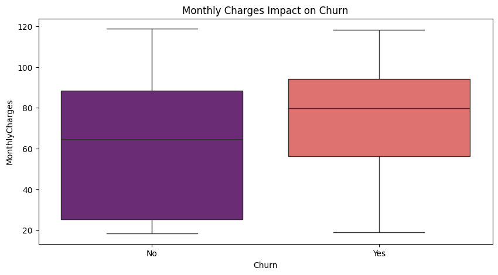
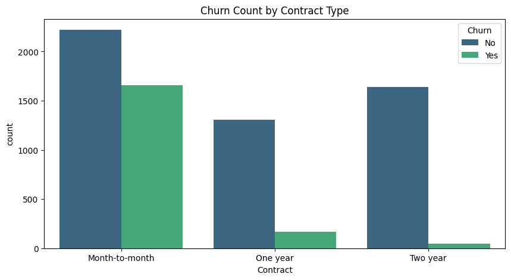

# subscription-churn-analysis
SQL and Python analysis to identify reasons for customer churn in a streaming service.
 📉 Business Strategist: Customer Churn Analysis

 🎯 Project Goal
To identify why customers are leaving the streaming service and provide data-backed strategies to improve retention.

 📊 Visualized Insights

Insight: High monthly charges are a primary driver for churn.

Insight: Month-to-month contracts have the highest turnover rate.

 🛠️ Tools Used
* Python (Pandas, Seaborn, Matplotlib): For data cleaning and visualization.
* Google Colab: Cloud-based environment for data analysis.
* GitHub: Version control and documentation.

 🔍 Key Findings
* Price Point: Customers who churn pay an average of $74, while loyal customers pay $61.
* Contract Risk: Over 40% of month-to-month subscribers leave, suggesting a need for long-term incentives.
